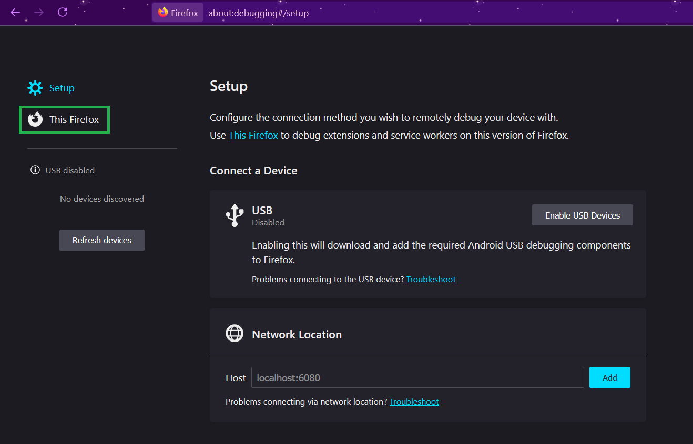
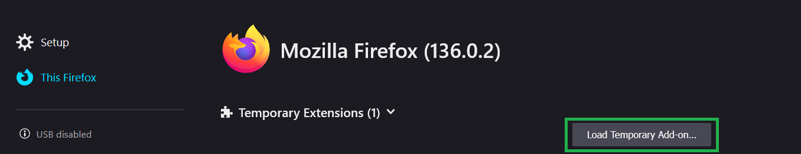
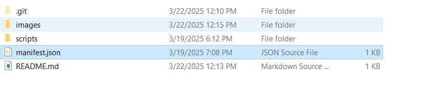
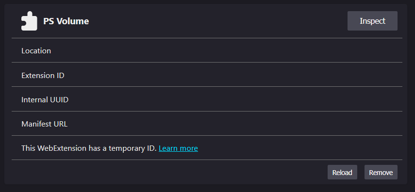
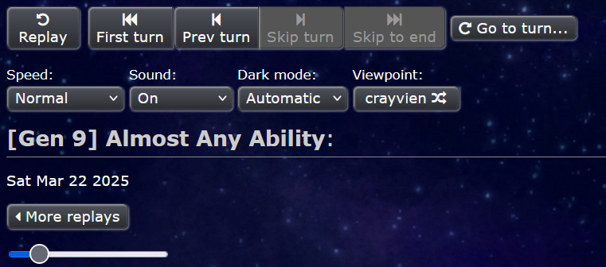

# The aim of this project is to create a seemless volume control extension for Pokemon Showdown replays.

The current state of this project is extremely simple. I am no front end developer. Please help to make it look nice and operate better.

# How to install this extension (FireFox)

### 1.) Enter `about:debugging` in the URL bar and click `This Firefox`

### 2.) Click `Load Temporary Add-on...`

### 3.) Navigate to the repo and double-click `manifest.json`

### 4.) You should see that the extension has been loaded in FireFox

### 5.) Load up a replay and adjust the slider!

